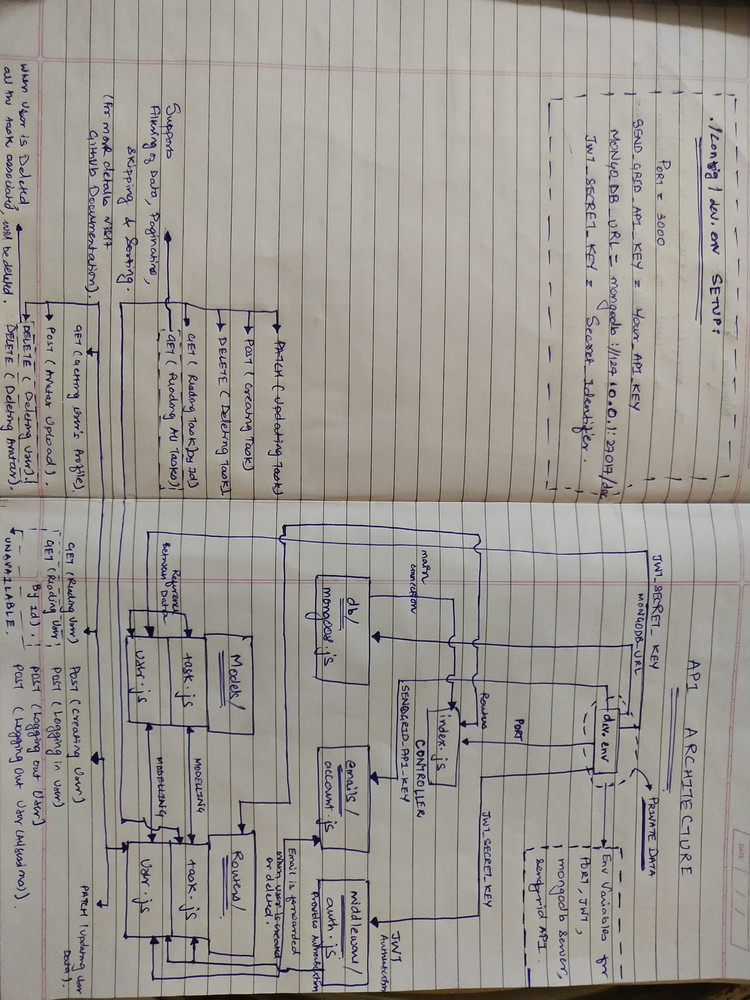

# Node.js based Task Manager API With Login System

:notebook:  :memo:  :email:  :books:

Task Manager API deployed on [Heroku](https://task-manager-notsonoobie.herokuapp.com).
***
## Project Status :

__`COMPLETE`__ :fire: 

## Environments Required :
* [Nodejs](https://nodejs.org/en/download/)
* [Npm](https://www.npmjs.com/package/download)
* [Git](https://git-scm.com/downloads)
* [MongoDB](https://mongodb.com/download-center/enterprise)
* [MongoDB Compass](https://mongodb.com/download-center/compass) __(Recommended for PROD)__ or [Robo3T](https://robomongo.org/download) __(Recommended for DEV)__
* [Postman](https://getpostman.com/downloads/)

## Check for proper Installation :

    $ node -v
    $ npm -v
    $ git --version
    
## Required Dependencies :
* `Express` [:link:](https://www.npmjs.com/package/express)
* `mongodb` [:link:](https://www.npmjs.com/package/mongodb)
* `mongoose` [:link:](https://www.npmjs.com/package/mongoose)
* `multer` [:link:](https://www.npmjs.com/package/multer)
* `jsonwebtoken` [:link:](https://www.npmjs.com/package/jsonwebtoken)
* `bcryptjs` [:link:](https://www.npmjs.com/package/bcryptjs)
* `sharp` [:link:](https://www.npmjs.com/package/sharp)
* `validator` [:link:](https://www.npmjs.com/package/validator)
* `@sendgrid/mail` [:link:](https://www.npmjs.com/package/@sendgrid/mail)

## Developer Dependencies :
* `env-cmd` [:link:](https://www.npmjs.com/package/env-cmd)
* `nodemon` [:link:](https://www.npmjs.com/package/nodemon)

## Environment Variables : 

1. Create `config` Directory inside `task-manager`
2. Create `dev.env` File inside `../task-manager/config/`
3. Define `PORT` (For Running Applications) , `SEND_GRID_API_KEY` (API Key for Sending Authenticated Emails) , `MONGO_DB_URL` (For Connection to MongoDB Database) , `JWT_SECRET_KEY` (For Verification of JWT Token)

To get details about how to declare Environment Variables visit  [`env-cmd`](https://www.npmjs.com/package/env-cmd) Documentation. I have not provided my own `.env` configuration file for security concerns, so refer to the documentation.

## Clients :

1. Install Clients :

        $ git clone https://github.com/notsonoobie/task-manager-api.git

        $ cd task-manager-api/

        $ npm install

2. Scripts :
   * Start Client (Prod Mode) :
   
         node src/app.js 

    * Start Client (Dev Mode) :

          env-cmd ./config/dev.env nodemon src/index.js

3. Start Client : 
   * Start Client (Prod Mode) :
   
          $ npm run start

    * Start Client (Dev Mode) :

          $ npm run dev
 

***
## *Project Description* :

This is a `Node.js` based Task Manager API supports JWT Authentication and Login System with Email Support. This app uses JWT Tokens for Authentication of User for Modifying `Profile` (User) / `Task` Data. The data is stored in MongoDB Database. User Can upload Profile Avatar using `multer` module support to the API which is then modified by `sharp` module and then stored in Database as Buffer. The task data can be viewed using endpoint which also offers `Filtering` , `Sorting` , &amp; `Pagination` of the Task Data. For every access/modification request User has to get Authenticated with Valid JWT verified Token. The entire architecture is based on `REST-API` which supports : 

* POST REQ - CREATING USER `{{url}}/users`
* POST REQ - LOGGING-IN USER `{{url}}/users/login`
* POST REQ - CREATING TASK `{{url}}/task`
* POST REQ - LOGGING-OUT USER `{{url}}/users/logout`
* POST REQ - LOGGING-OUT USER (ALL SESSIONS) `{{url}}/users/logoutAll`
* POST REQ - UPLOADING AVATAR(PROFILE) `{{url}}/users/me/avatar`
* GET REQ - READING PROFILE `{{url}}/users/me`
* GET REQ - READING A TASK `{{url}}/task/:taskid`
* GET REQ - READING TASKS :
    * For Reading All Task : `{{url}}/tasks`
    * For Reading Filtered Task based on Status : `{{url}}/tasks?status=true|false`
    * For Reading Limited Task : `{{url}}/tasks?limit=:NumberToLimit`
    * For Reading Task after Skipping few Task : `{{url}}/tasks?skip=:NumberToSkip`
    * For Reading Sorted in Asc Order based on Property : `{{url}}/tasks?sortBy=:prop::asc`
    * For Reading Sorted in Desc Order based on Property : `{{url}}/tasks?sortBy=:prop::desc`
* GET REQ - VIEWING AVATAR `{{url}}/users/:userid/avatar`
* PATCH REQ - UPDATING USER `{{url}}/users/me`
* PATCH REQ - UPDATING TASK `{{url}}/task/:taskid`
* DELETE REQ - DELETING USER `{{url}}/user/me`
* DELETE REQ - DELETING AVATAR `{{url}}/users/me/avatar`
* DELETE REQ - DELETING TASK `{{url}}/task/:taskid`

## **POSTMAN WORKFLOW AND AUTOMATION**

The Post App need to be configured and Scipted for Automation of the workflow for Authentication ___(Although it is not necessary).___ 

* Load the Collection from : `../task-manager/Postman Collection/Task App.postman_collection.json` into Postman APP.
* Load Environment Variables for Dev into Postman APP : `../task-manager/Postman Collection/Task Manager API (dev).postman_environment.json`
* Load Environment Variables for Prod into Postman APP : `../task-manager/Postman Collection/Task Manager API (Prod).postman_environment.json`

You are good to go... :grimacing:

## **Project Architecture**

<h1 align="center">
	 
	 
	
	 
	 
	 
</h1>

## **NOTE** :

You can use the code under MIT License but mention of Author ( Rahul Gupta [@notsonoobie](https://github.com/notsonoobie) ) is appreciable.
***
   
## *Contact Me*

:phone: +91-89288-85199

:e-mail: swastikmedical74@gmail.com

:globe_with_meridians: http://showcasingmyself.netlify.com

:octocat: [notsonoobie](https://github.com/notsonoobie)

***

&copy; Rahul Gupta ([notsonoobie](https://github.com/notsonoobie)) -- Thank You! :nerd_face:
